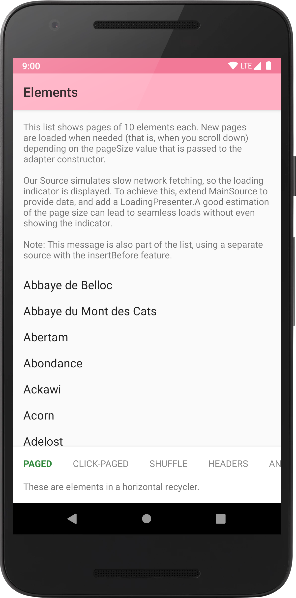
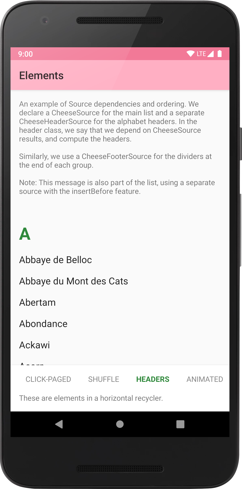
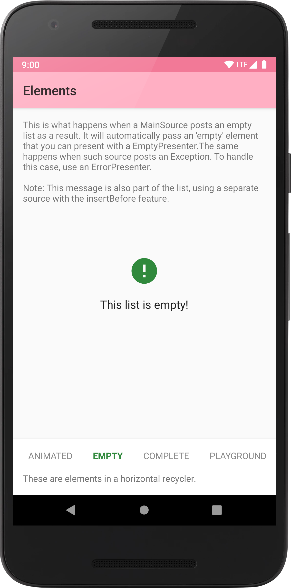

[](https://github.com/natario1/Elements/actions)
[](https://github.com/natario1/Elements/releases)
[](https://github.com/natario1/Elements/issues)

<p align="center">
  
</p>

*Need support, consulting, or have any other business-related question? Feel free to <a href="mailto:mat.iavarone@gmail.com">get in touch</a>.*

*Like the project, make profit from it, or simply want to thank back? Please consider [sponsoring me](https://github.com/sponsors/natario1)!*

# Elements

A collection of modular elements for `RecyclerView` lists, alternative to
[Google's Paging library](https://developer.android.com/topic/libraries/architecture/paging/), designed in Kotlin with these goals in mind:

```kotlin
implementation("com.otaliastudios:elements:0.3.7")
```

Design features:

- Separation of concerns: we split the model component into `Source`s, and the UI component into `Presenter`s. [[docs]](https://natario1.github.io/Elements/docs/sources)
- Simplicity: No need to extend Adapters, ViewHolders or all that Paging lib. boilerplate.
- Reusability: as a result, each `Source` and `Presenter` is an independent piece of code that can be reused.
- Modularity: let the adapter accept multiple `Source`s and `Presenter`s. [[docs]](https://natario1.github.io/Elements/docs/adapter)
- Testability: a consequence of the above, each component can be independently tested.
- Coordination: let `Source`s declare dependencies among them, in a `CoordinatorLayout.Behavior` fashion. [[docs]](https://natario1.github.io/Elements/docs/coordination)
- Paging: built-in concept of `Page`. [[docs]](https://natario1.github.io/Elements/docs/pagination)
- Integration with Arch components: heavy use of `LiveData` and `Lifecycle`s, extensions for data binding.
- Animations: give `Presenters`s fine grained control over how to animate each item [[docs]](https://natario1.github.io/Elements/docs/animations)

If you are curious about how it works in practice, take a look at the sample app in the `app` module.

&#10240;  <!-- Hack to add whitespace -->

<p align="center">
  
</p>

&#10240;  <!-- Hack to add whitespace -->

## Support

If you like the project, make profit from it, or simply want to thank back, please consider
[sponsoring me](https://github.com/sponsors/natario1) through the GitHub Sponsors program!
You can have your company logo here, get private support hours or simply help me push this forward.

Feel free to <a href="mailto:mat.iavarone@gmail.com">contact me</a> for support, consulting or any
other business-related question.

## Setup

Please read the [official website](https://natario1.github.io/Elements/home) for setup instructions and documentation.
You might also be interested in our [changelog](https://natario1.github.io/Elements/about/changelog). After migrating  
to Elements, your code will look like the examples below.

Simplest single-paged list:

```kotlin
val data = listOf("Monday", "Tuesday", "Wednesday", "Friday", "Saturday", "Sunday")
Adapter.builder(lifecycle)
    .addSource(Source.fromList(data))
    .addPresenter(Presenter.simple(context, R.layout.item, { view, day -> view.text = day }))
    .into(recyclerView)
```

Paged list with multiple sources and presenters, headers, ads, error/empty indicators and progress bars:

```kotlin
Adapter.builder(lifecycle)
    .addSource(ContactsSource()) // Add a paged list of contacts
    .addSource(ContactsHeaderSource()) // Add the letters A, B, C as a header
    .addSource(AdSource(5)) // Add some ads each 5 items
    .addPresenter(ContactsPresenter(context))
    .addPresenter(ContactsHeaderPresenter(context))
    .addPresenter(AdPresenter(context))
    .addPresenter(Presenter.forLoadingIndicator(context, R.layout.loading))
    .addPresenter(Presenter.forErrorIndicator(context, R.layout.error))
    .addPresenter(Presenter.forEmptyIndicator(context, R.layout.empty))
    .into(recyclerView)
```
